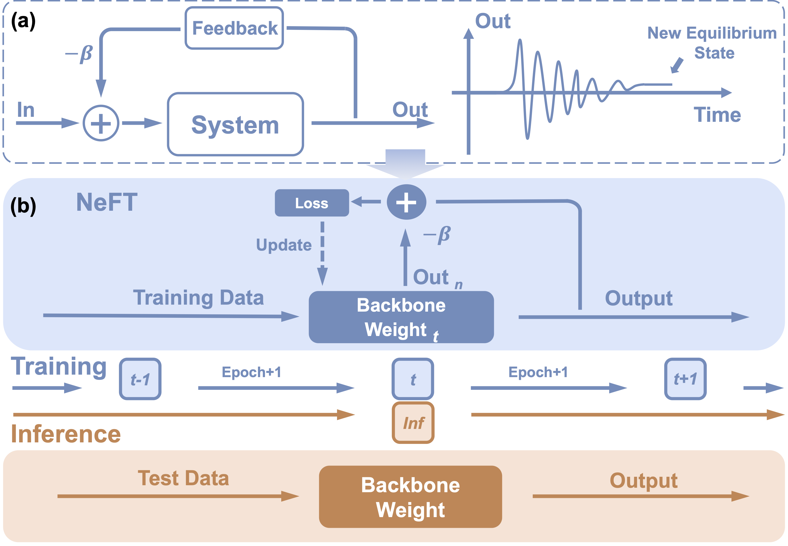
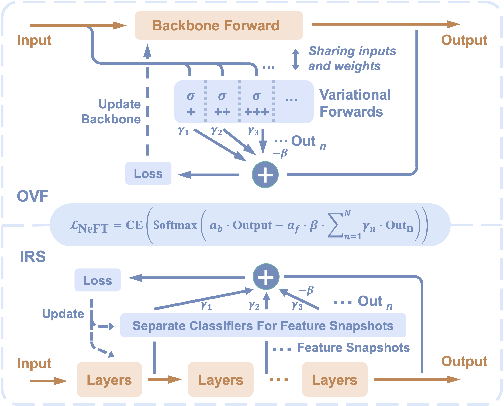
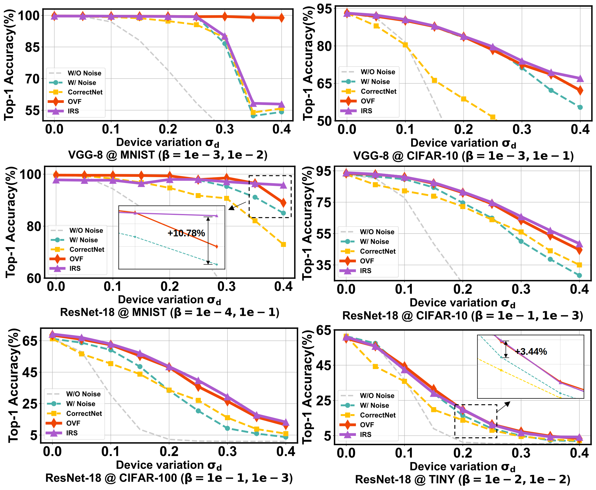
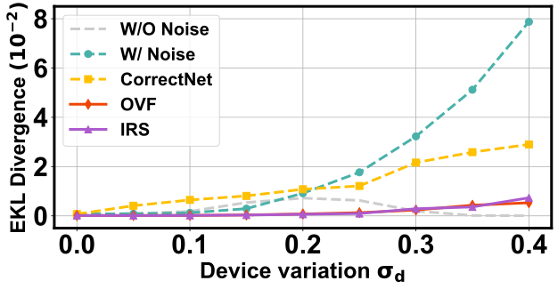

# **NeFT**: **Ne**gative **F**eedback **T**raining to Improve Robustness of Compute-In-Memory DNN Accelerators
Yifan Qin, Zheyu Yan, Dailin Gan, Jun Xia, Zixuan Pan, Wujie Wen, Xiaobo Sharon Hu, Yiyu Shi

[[Arxiv](https://arxiv.org/abs/2305.14561)] [](./LICENSE "LICENSE") 

Code for paper "**NeFT**: **Ne**gative **F**eedback **T**raining to Improve Robustness of Compute-In-Memory DNN Accelerators".

# Overview
Compute-in-memory accelerators built upon non-volatile memory devices excel in energy efficiency and latency when performing deep neural network (DNN) inference, thanks to their in-situ data processing capability. 
However, the stochastic nature and intrinsic variations of non-volatile memory devices often result in performance degradation during DNN inference.
Introducing these non-ideal device behaviors in DNN training enhances robustness, but drawbacks include limited accuracy improvement, reduced prediction confidence, and convergence issues. This arises from a mismatch between the deterministic training and non-deterministic device variations, as such training, though considering variations, relies solely on the model's final output.
In this work, inspired by control theory, we propose Negative Feedback Training (NeFT)—a novel concept supported by theoretical analysis—to more effectively capture multi-scale noisy information throughout the network. We instantiate this concept with two specific methods, oriented variational forward (OVF) and intermediate representation snapshot (IRS). Extensive experiments show that our methods outperform existing state-of-the-art methods with up to a 45.08% improvement in inference accuracy while reducing epistemic uncertainty, boosting output confidence, and improving convergence probability. These results underline the generality and practicality of our NeFT framework for boosting DNN robustness against device variations.

<div align="center">

</div>

<div align="center">

</div>

# Robustness Improvements

Our negative feedback training improves the accuracy of inference w/ noise and decreases the uncertainty (expected KL divergence).

<p align="center">
  
</p>

<p align="center">
  
</p>

# Requirements
- Python >=3.6   
- Pytorch
- torchvision
- Others see environment.yml

# Usage
The main code is in 'vgg8_main.py' and 'res18_main.py'.
## Training and Monte Carlo simulation with noise
```shell
python res18_main.py --mode tnt --type irs --dataset cifar10 --var1 0.1 --var2 0.1 --device RRAM1 --num 1 --mark 1.1
```

## Arguments:
```shell
--mode      # train / test / tnt: train mode or Monte Carlo test mode or train + Monte Carlo test mode
--type      # base / irs / ovf: noise-injection training method or IRS method or OVF method
--dataset   # dataset name
--var1      # device variation for backbone
--var2      # device variation for blocks of IRS method
--device    # RRAM1 / RRAM4 / FeFET2 / FeFET6: device type for different noise models in different NVM devices
--num       # sub-label for array task
--mark      # label for job
```

## Configurations in config.py
```shell
DATA_PATH   # path to dataset
WEIGHT_BIT  # weight bit-width
DEVICE_BIT  # device bit-width
MC_times    # Monte Carlo simulation times
```

## Extending this repo
This repo is quite friendly for those who are familar with PyTorch.

## Writting your own method
- Please refer to /models to syntax of writting your own models.
- Please refer to /config.py to syntax of writting your own config.

# License
This repository is released under the MIT license. See [LICENSE](LICENSE) for additional details.
